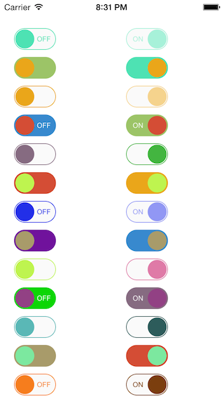

ZJSwitch
========

ZJSwitch is a simple implmentation for swtich control that similar to UISwitch. 

ZJSwitch can add text on control for on of off status.

How to use it
--------

```Objective-C
    ZJSwitch *switch0 = nil;
    UIColor *onTintColor = nil;
    UIColor *tintColor = nil;
    UIColor *thumbTintColor = nil;
    ZJSwitchStyle style = ZJSwitchStyleBorder;
    NSString *onText = nil;
    NSString *offText = nil;
    
    for (NSInteger i = 0; i < 13; i++) {
        style = i % 2 == 0 ? ZJSwitchStyleBorder : ZJSwitchStyleNoBorder;
        
        srand((unsigned int)i + 1);
        onTintColor = [UIColor colorWithRed:(rand() % 256) / 255.0
                                      green:(rand() % 256) / 255.0
                                       blue:(rand() % 256) / 255.0
                                      alpha:1.0];
        
        srand((unsigned int)(i + 1) * 2);
        tintColor = [UIColor colorWithRed:(rand() % 256) / 255.0
                                    green:(rand() % 256) / 255.0
                                     blue:(rand() % 256) / 255.0
                                    alpha:1.0];
        
        srand((unsigned int)(i + 1) * 3);
        thumbTintColor = [UIColor colorWithRed:(rand() % 256) / 255.0
                                         green:(rand() % 256) / 255.0
                                          blue:(rand() % 256) / 255.0
                                         alpha:1.0];
        
        onText = (i % 3 == 0) ? @"ON" : nil;
        offText = (i % 3 == 0) ? @"OFF" : nil;
        
        switch0 = [[ZJSwitch alloc] initWithFrame:CGRectMake(20, i * (10 + 31) + 40, 60, 31)];
        switch0.style = style;
        switch0.onTintColor = onTintColor;
        switch0.tintColor = tintColor;
        switch0.thumbTintColor = thumbTintColor;
        switch0.onText = onText;
        switch0.offText = offText;
        [switch0 addTarget:self action:@selector(handleSwitchEvent:) forControlEvents:UIControlEventValueChanged];
        [self.view addSubview:switch0];
        
        switch0 = [[ZJSwitch alloc] initWithFrame:CGRectMake(180, i * (10 + 31) + 40, 60, 31)];
        switch0.style = style;
        switch0.onTintColor = onTintColor;
        switch0.tintColor = tintColor;
        switch0.thumbTintColor = thumbTintColor;
        switch0.onText = onText;
        switch0.offText = offText;
        [switch0 addTarget:self action:@selector(handleSwitchEvent:) forControlEvents:UIControlEventValueChanged];
        [self.view addSubview:switch0];
        
        switch0.on = YES;
    }
```

How does it look like
--------




